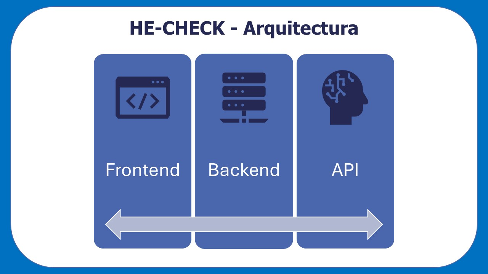
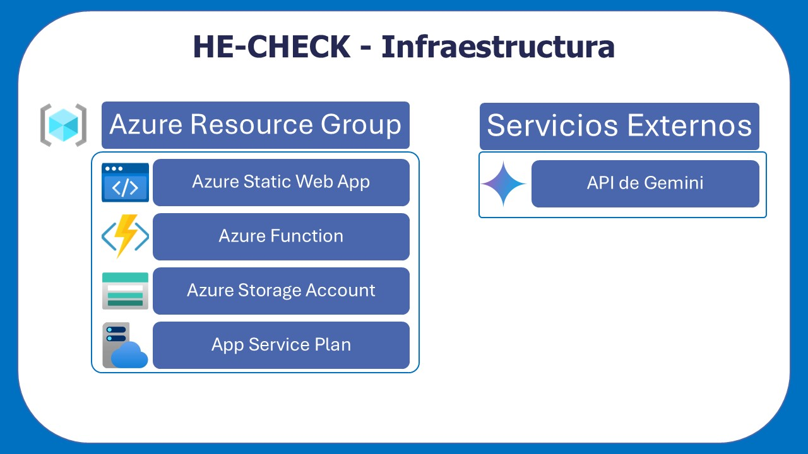
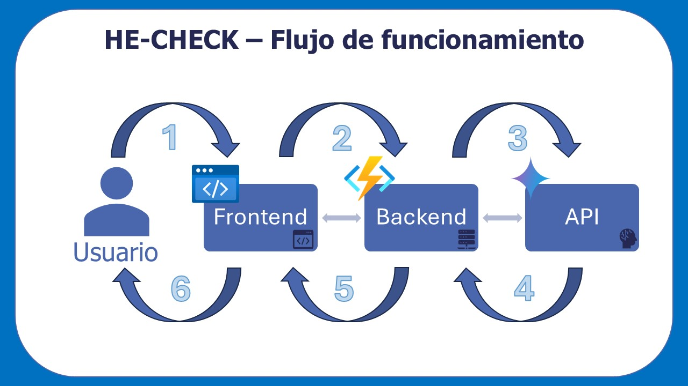
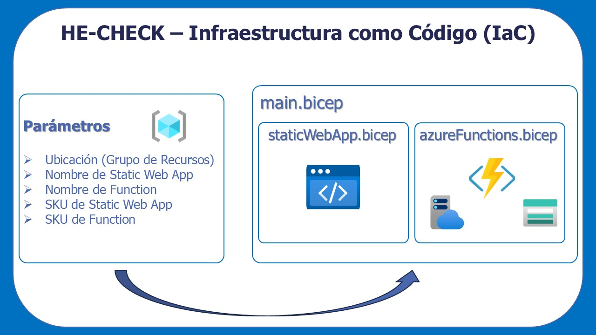

# HE-CHECK

## Arquitectura e Infraestructura

---

**Fecha:** 31/03/2026  
**Autor:** Alejandro Soult Toscano

---

## Índice

[1. Descripción de la arquitectura](#1-descripción-de-la-arquitectura)  
[2. Descripción de la infraestructura](#2-descripción-de-la-infraestructura)  
[3. Flujo de navegación y acciones de la página](#3-flujo-de-funcionamiento-de-la-aplicación)  
[4. Utilización de infraestructura como código (IaC)](#4-utilización-de-infraestructura-como-código-iac)  

---

## 1. Descripción de la arquitectura

La aplicación HE-CHECK sigue una arquitectura modular basada en la separación en capas. Los principales componentes arquitectónicos son:

- **Frontend** *(ubicación: [/he-check](../he-check/))*: Aplicación web SPA desarrollada con React y Vite. Se encarga de la interacción con el usuario, recogida de datos de la propuesta y visualización de resultados.

- **Backend** *(ubicación: [/ai-function](../ai-function/))*: Implementado mediante Azure Functions. Actúa como intermediario entre el frontend y la API externa de Inteligencia Artificial (IA), gestionando la construcción del prompt (mediante un sistema basado en una plantilla reutilizable en el que se inyecta los datos de la propuesta introducidos por el susuario) y el procesamiento de la respuesta y errores.

- **Integración con API de Inteligencia Artificial (IA)**: Servicio externo encargado de generar la evaluación de la propuesta a partir del prompt construido en el backend.

Esta arquitectura permite una clara separación de responsabilidades, alta cohesión y bajo acoplamiento. De esta forma, se facilita la mantenibilidad, escalabilidad y sustitución de componentes.

## 2. Descripción de la infraestructura

Todos los recursos propios de la aplicación se encuentran desplegados en la nube dentro de un **grupo de recursos de Azure**, lo que permite gestionarlos de forma conjunta y organizada.

Los principales recursos utilizados son:

- **Azure Static Web Apps**: Servicio encargado de alojar el frontend de la aplicación. Permite desplegar aplicaciones estáticas de forma sencilla y eficiente, sin producir muchos gastos.

- **Azure Functions**: Servicio serverless utilizado para implementar el backend. Permite ejecutar código bajo demanda sin necesidad de gestionar servidores, escalando automáticamente según la carga y optimizando el consumo de recursos.

- **Azure Storage Account**: Recurso utilizado internamente por Azure Functions para almacenar archivos necesarios para su ejecución, como configuraciones (`host.json`, `function.json`) y otros artefactos del sistema.

- **App Service Plan**: Plan de consumo utilizado por Azure Functions. El plan seleccionado es el `Y1`, el cual se trata de la opción más económica (modelo serverless), ya que solo consume recursos cuando se ejecuta código, siendo suficiente para el alcance de este proyecto.

Además de los mencionados, hay que destacar la presencia de recursos externos con la **infraestructura del modelo de IA (Gemini)**, el cual se comunicará con la aplicación mediante el uso de su API.

Esta infraestructura permite un despliegue ligero, escalable y de bajo coste, adecuado para un entorno académico.

## 3. Flujo de funcionamiento de la aplicación

El funcionamiento de la aplicación sigue un flujo sencillo basado en la comunicación entre componentes:

1. El usuario introduce los datos de la propuesta en el **frontend**.
2. El frontend envía una petición HTTP al **backend (Azure Function)**.
3. El backend:
    - Construye el prompt a partir de una plantilla y los datos recibidos.
    - Realiza una petición a la **API de Gemini**.
4. La API de Gemini procesa el prompt y devuelve una respuesta.
5. El backend:
    - Extrae y formatea la información relevante.
    - Devuelve el resultado al frontend.
6. El frontend muestra la evaluación al usuario de forma estructurada.

Este flujo desacopla completamente la lógica de presentación de la lógica de procesamiento, permitiendo modificar o ampliar cada parte de manera independiente.

## 4. Utilización de infraestructura como código (IaC)

La infraestructura de HE-CHECK ha sido definida mediante **Infrastructure as Code (IaC)** utilizando archivos `Bicep`, lo que permite automatizar y reproducir el despliegue en cualquier entorno Azure.

Se han definido tres archivos principales:

- **azureFunctions.bicep**: Es el encargado de crear los recursos necesarios para el backend:
    - Storage Account
    - App Service Plan
    - Azure Function

- **staticWebApp.bicep**: Es el encargado de definir el recurso de Azure Static Web Apps para el despliegue del frontend.

- **main.bicep**: Se trata del archivo orquestador que invoca a los otros dos, recibiendo los siguientes parámetros:
    - Ubicación (Grupo de Recursos)
    - Nombre de la Static Web App
    - Nombre de la Function
    - SKU de la Static Web App
    - SKU de la Function

El uso de Bicep permite que la infraestructura sea completamente portable y reutilizable. Cualquier usuario con una cuenta de Azure puede desplegar todos los recursos ejecutando un único comando, adaptando únicamente los parámetros necesarios. Además, mediante la configuración de variables de entorno y secretos, es posible cambiar de plataforma de despliegue, o incluso cambiar la API de IA utilizada.

La configuración detallada de estas variables y secretos se explicará en documentos posteriores.