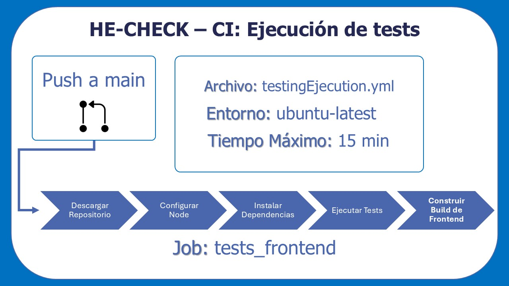
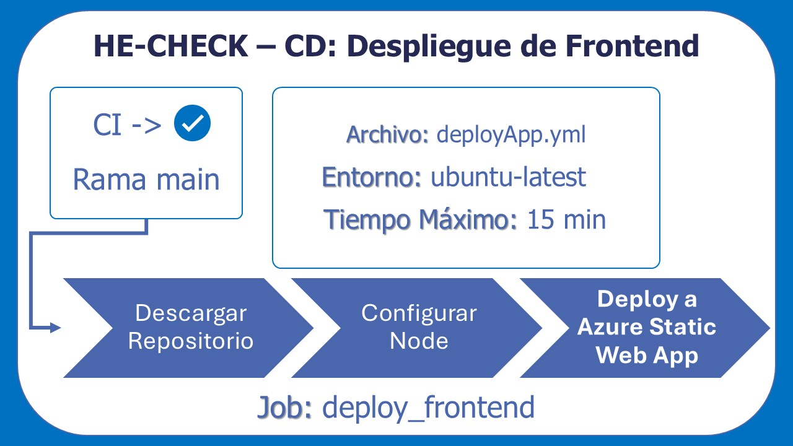

# HE-CHECK

## Gestión de la configuración y CI/CD


---

**Proyecto:** HE-CHECK  
**Fecha:** 31/03/2026  
**Autor:** Alejandro Soult Toscano

---

## Índice

[1. Gestión de la configuración](#1-gestión-de-la-configuración)  
[2. Gestión de ramas](#2-gestión-de-ramas)  
[3. Integración Continua (CI): Ejecución de tests](#3-integración-continua-ci-ejecución-de-tests)  
[4. Despliegue Continuo (CD): Despliegue de Aplicación Frontend](#4-despliegue-continuo-cd-despliegue-de-aplicación-frontend)  
[5. Despliegue Continuo (CD): Despliegue de Aplicación Backend](#5-despliegue-continuo-cd-despliegue-de-aplicación-backend)  

---

## 1. Gestión de la configuración

La gestión de la configuración del proyecto se basa en el uso de un repositorio centralizado en GitHub, donde se almacena todo el código fuente, configuraciones, documentación y workflows necesarios para el desarrollo y despliegue de HE-CHECK.

Para la organización y seguimiento del trabajo, se utiliza un **GitHub Project**, donde cada tarea se gestiona como una *issue*. Estas tareas se clasifican mediante etiquetas o *labels* según distintos criterios:

- **Clasificación por tipo de tarea:**
  - `CODE` → Tareas de desarrollo con código
  - `CONFIG` → Tareas de configuración, arquitectura o infraestructura
  - `DOC` → Tareas de documentación
  - `FIRST TASK` → Tarea inicial del desarrollo
  - `OTHER` → Tareas no incluidas en otras categorías
  - `TEST` → Tareas de testing

- **Clasificación por prioridad:**
  - `priority:high` → Alta prioridad
  - `priority:medium` → Prioridad media
  - `priority:low` → Baja prioridad

- **Clasificación por tamaño de tarea:**
  - `XS`, `S`, `M`, `L`, `XL`

Además, el repositorio cuenta con **tres workflows de GitHub Actions**, uno de Integración Continua (CI) y dos de Despliegue Continuo (CD), que se describen en apartados posteriores.

---

## 2. Gestión de ramas

El modelo de desarrollo utilizado es **trunk-based development**, que permite una integración continua y evita divergencias y conflictos entre ramas.

Las ramas del repositorio se estructuran de la siguiente forma:

- **main**: Es la rama principal del repositorio. Contiene el código listo para producción y es la rama que se despliega en la nube.

- **trunk**: Es la rama de integración donde se consolidan los cambios provenientes de las distintas tareas antes de ser promovidos a main.

- **Ramas de tarea**: Cada tarea se desarrolla en una rama independiente asociada a una issue. El formato de nombrado de las mismas es:

  ```
  [tipo_de_tarea]/id_de_issue-nombre-de-tarea
  ```

## 3. Integración Continua (CI): Ejecución de tests

El proceso de Integración Continua está definido en el workflow **`testingEjecution.yml`**. Sus elementos principales son:

- Disparador (trigger): Se ejecuta automáticamente en cada **push a la rama main**.

- Job principal: `tests_frontend`
    - *Entorno:* `ubuntu-latest`
    - *Tiempo máximo:* 15 minutos

Los pasos del job principal son:

- **Descargar Repositorio**
  - Descarga el código del repositorio.
  - Acción: `actions/checkout@v4`

- **Configurar Node**
  - Configura el entorno de Node.js (versión 20).
  - Habilita caché de dependencias (`npm`).
  - Acción: `actions/setup-node@v4`

- **Instalar dependencias**
  - Ejecuta `npm ci` en el directorio del frontend (`he-check`).
  - Instalación limpia y reproducible basada en `package-lock.json`.

- **Ejecutar tests**
  - Lanza los tests definidos en el proyecto (`npm test`).

- **Construir Build de Frontend**
  - Genera la versión de producción del frontend (`npm run build`).
  - Permite validar que la aplicación compila correctamente.



## 4. Despliegue Continuo (CD): Despliegue de Aplicación Frontend

El despliegue del frontend está definido en el workflow **`deployApp.yml`**. Sus elementos principales son:

- Disparador (trigger): Se ejecuta cuando finaliza el workflow anterior, y solo se realiza si:
  - La ejecución anterior fue exitosa (`success`)
  - La rama es `main`

- Job principal: `deploy_frontend`
    - *Entorno:* `ubuntu-latest`
    - *Tiempo máximo:* 15 minutos

Los pasos del job principal son:

- **Descargar Repositorio**
  - Descarga el código fuente.

- **Configurar Node**
  - Configura Node.js (versión 20).

- **Deploy a Azure Static Web App**
  - Despliega la aplicación en Azure Static Web Apps.
  - Acción: `Azure/static-web-apps-deploy@v1`

Otras características relevantes son:

  **Configuración:**
  - Uso de variables de entorno (definidas como *secrets* en GitHub)
  - Construcción del frontend mediante:
    ```
    npm run build
    ```
  - Directorios:
    - Código fuente: `he-check`
    - Output: `dist`

  **Secrets utilizados (descritos más adelante):**
  - `AZURE_STATIC_WEB_APPS_API_TOKEN`
  - `GITHUB_TOKEN`
  - Variables de entorno como endpoint del backend



## 5. Despliegue Continuo (CD): Despliegue de Aplicación Backend

El despliegue del backend está definido en el workflow **`deployFunction.yml`**. Sus elementos principales son:

- Disparador (trigger): Se ejecuta automáticamente en cada **push a la rama main**, y solo se realiza si hay cambios dentro de `ai-function/`

- Job principal: `deploy_function`
    - *Entorno:* `ubuntu-latest`
    - *Tiempo máximo:* 15 minutos

Los pasos del job principal son:

- **Descargar Repositorio**
  - Descarga el código del repositorio.

- **Configurar Node**
  - Configura Node.js (versión 20).

- **Deploy a Azure Function**
  - Despliega la función en Azure Functions.
  - Acción: `Azure/functions-action@v1`

Otras características relevantes son:

  **Configuración relevante:**
  - Nombre de la aplicación: `he-check-function`
  - Código fuente: `ai-function`

  **Secrets utilizados (descritos más adelante):**
  - `AZURE_FUNCTIONS_PUBLISH_PROFILE`


---

La descripción detallada de los *secrets*, variables de entorno se incluirá en documentos posteriores.