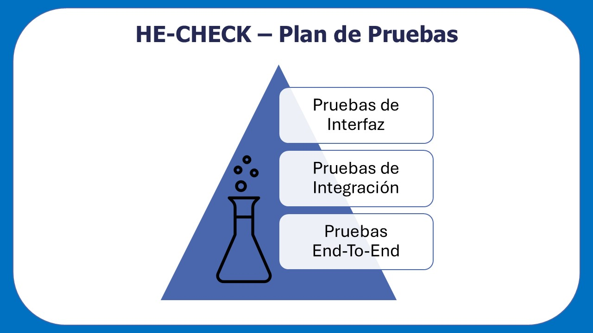

# HE-CHECK

## Plan de pruebas

---

**Proyecto:** HE-CHECK  
**Fecha:** 31/03/2026  
**Autor:** Alejandro Soult Toscano

---

## Índice

[1. Descripción general del testing](#1-descripción-general-del-testing)  
[2. Tipos de pruebas implementadas](#2-tipos-de-pruebas-implementadas)  
[3. Cobertura de las pruebas sobre la aplicación](#3-cobertura-de-las-pruebas-sobre-la-aplicación)  
[4. Lista de pruebas implementadas](#4-lista-de-pruebas-implementadas)  

---

## 1. Descripción general del testing

La estrategia de pruebas de la aplicación se basa en un enfoque escalonado que combina distintos niveles de pruebas para garantizar la calidad del sistema. Se han distintos tipos de pruebas, organizándose de mayor a menor cantidad. De esta forma, se han priorizando las pruebas más rápidas, mientras que se han realizado una menor cantidad de aquellas pruebas con mayor lentitud y coste.

Independientemente del tipo de prueba, cada una define claramente su **SUT (Subject Under Test)**, que representa el componente, módulo o flujo específico que se está validando.

---

## 2. Tipos de pruebas implementadas

Se han clasificado las pruebas por varios criterios:

### 2.1 Clasificación por tipo de prueba

- **Pruebas de interfaz (unitarias)**: Verifican el renderizado de componentes y la presencia de elementos clave en la interfaz, así como interacciones básicas del usuario.

- **Pruebas de integración**: Validan la comunicación entre el frontend y la API, incluyendo tanto respuestas exitosas como escenarios de error.

- **Pruebas end-to-end (E2E)**: Simulan el comportamiento real del usuario, recorriendo todo el flujo desde la introducción de datos hasta la obtención de resultados.

### 2.2 Clasificación por módulo

- **Home.jsx**
  - Pruebas unitarias
  - Pruebas de integración (éxito y fallo)
  - Pruebas end-to-end

- **About.jsx**
  - Pruebas unitarias

- **Info.jsx**
  - Pruebas unitarias

## 3. Cobertura de las pruebas sobre la aplicación
La cobertura global obtenida en la ejecución de pruebas es la siguiente, dividida en los siguientes criterios:
- Statements: *73.03%*
- Branches: *72.54%*
- Functions: *78.26%*
- Lines: *74.07%*

Para reportar una cifra única de cobertura global, se tomará como referencia la cobertura por líneas:
- **Cobertura global (Lines): 74.07%.**

La cobertura alcanzada puede considerarse adecuada para el alcance y la naturaleza del proyecto, especialmente teniendo en cuenta que los módulos críticos, como el componente Home y la función de interacción con la API, están correctamente validados mediante pruebas tanto unitarias como de integración y end-to-end.

El porcentaje no cubierto corresponde principalmente a secciones de código de menor relevancia, como partes estáticas de la interfaz, casos poco probables o manejo de errores internos y de la API. Por tanto, el nivel de cobertura obtenido garantiza un grado razonable de fiabilidad y estabilidad del sistema, asegurando que los flujos principales de uso han sido correctamente verificados.

## 4. Lista de pruebas implementadas

### 4.1 Pruebas unitarias

#### 4.1.1 Módulo: Home.jsx
- **it('renderiza las secciones de información y el formulario de propuesta')**
  - **SUT**: Componente Home
  - **Entradas**: Ninguna
  - **Salida esperada**: Se renderizan correctamente las secciones principales de información (“¿Qué es HE-CHECK?”, “¿Cómo funciona?”), el formulario y el botón “Analizar”

- **it('envía los datos al pulsar el botón de "Analizar" y muestra la respuesta mockeada de la API')**
  - **SUT**: Componente Home
  - **Entradas**: Datos de la propuesta en el formulario
  - **Salida esperada**: Se realiza una llamada a la función de API con los datos correctamente estructurados y se muestran los resultados mockeados en la interfaz

#### 4.1.2 Módulo: About.jsx
- **it('renderiza las secciones de información del autor y del framework')**
  - **SUT**: Componente About
  - **Entradas**: Ninguna
  - **Salida esperada**: Se renderizan correctamente las secciones principales de información (“Sobre el autor”, “Relación con el framework FRONDA” y “Enlaces de interés”)

- **it('renderiza los enlaces externos con información del repositorio y el perfil del autor')**
  - **SUT**: Componente About
  - **Entradas**: Ninguna
  - **Salida esperada**: Los enlaces externos contienen las URLs correctas hacia GitHub y LinkedIn

#### 4.1.3 Módulo: Info.jsx
- **it('renderiza las secciones de información de Horizonte Europa')**
  - **SUT**: Componente Info
  - **Entradas**: Ninguna
  - **Salida esperada**: Se renderizan correctamente las secciones principales de información ("¿Qué es Horizonte Europa?", "De propuesta a proyecto financiado", "¿Por qué es importante una buena propuesta?" y "Más información")

- **it('renderiza los enlaces externos con información adicional del programa')**
  - **SUT**: Componente Info
  - **Entradas**: Ninguna
  - **Salida esperada**: Los enlaces externos apuntan a las páginas oficiales correspondientes

### 4.2 Pruebas de integración

#### 4.2.1 Módulo: Home.jsx (Éxito)
- **it('muestra resultados correctos cuando la API responde correctamente sin input_error')**
  - **SUT**: Integración entre Home y la API
  - **Entradas**: Datos válidos de la propuesta en el formulario
  - **Salida esperada**: Se realiza una petición HTTP POST al endpoint configurado y se muestran correctamente los resultados devueltos por la API

#### 4.2.2 Módulo: Home.jsx (Fallo)
- **it('muestra input_error cuando la API responde con error')**
  - **SUT**: Integración entre Home y la API
  - **Entradas**: Datos inválidos de la propuesta en el formulario
  - **Salida esperada**: Se muestra un mensaje de error en la interfaz indicando el fallo en la comunicación con la API, incluyendo el código de estado y descripción

### 4.3 Pruebas end-to-end (E2E)

#### 4.3.1 Módulo: Home.jsx
- **it('escribe los datos de la propuesta y se ejecuta el análisis correctamente')**
  - **SUT**: Flujo completo de usuario en la aplicación
  - **Entradas**: Datos reales de propuesta cargados desde un archivo JSON
  - **Salida esperada**: Todo el flujo funciona correctamente, siguiéndose los siguientes pasos:
    - El usuario puede completar todos los campos del formulario
    - Se lanza la petición al endpoint de análisis
    - Se muestra un estado de carga (“Analizando documento...”)
    - Se recibe una respuesta exitosa (HTTP 200)
    - Se renderizan los apartados de los resultados ("Excelencia", "Impacto", "Implementación" y "Conclusiones")
    - Se muestran acciones adicionales como “Volver” y “Copiar (JSON)”

---

Este conjunto de pruebas proporciona una validación completa del sistema, cubriendo tanto el comportamiento interno de los componentes como su interacción con servicios externos y el flujo completo de usuario.